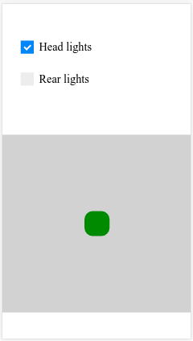

# ESP remote control

Controlling a vehicle with ESP8266 chip via WiFi.

## Prerequisites

* Arduino IDE
* Node.js
* Node.js package manager (npm)

## Before you start

Install node dependencies:

```bash
npm install
```

## Compiling the project

To compile the arduino project, run:

```bash
node ./node_modules/gulp/bin/gulp.js
```

The resulting sketch will be in  `dist/server/server.ino`.

## Having fun

* Load the resulting sketch `server.ino` to ESP8266 via standard Arduino IDE
* Power on the micro controller board
* Connect to WiFi access point naming "ESP_ap". The board will work as a [captive portal](https://www.hackster.io/rayburne/esp8266-captive-portal-5798ff)
* Open browser and go to http://esp8266.local 
* You will see the control panel:
* 
* Drag green dot towards means acceleration, moving right/left means turning
